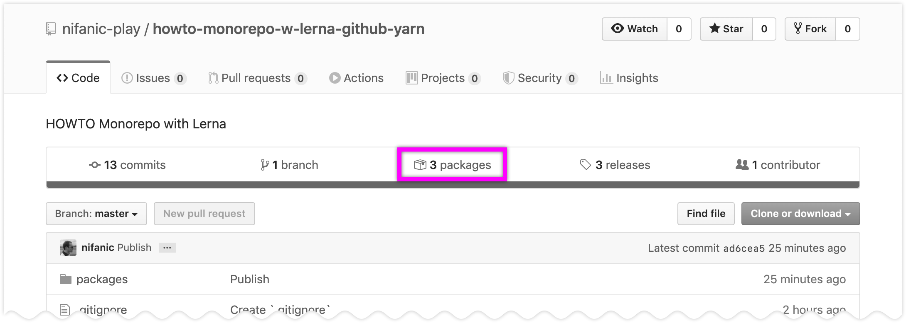
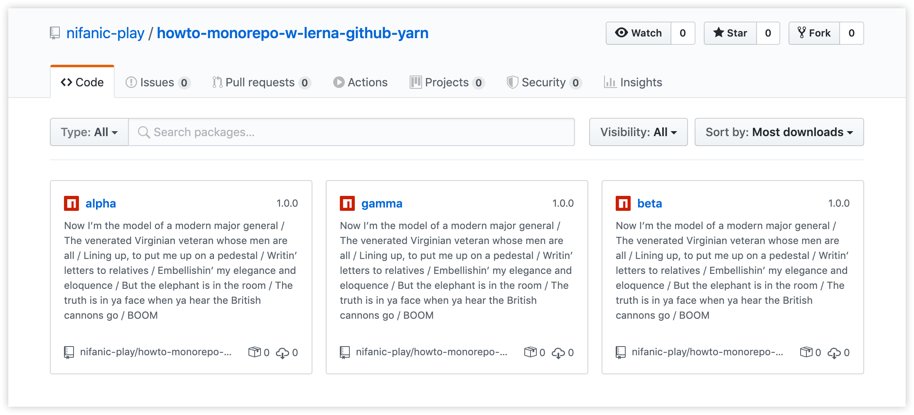

# Monorepo with Lerna, TypeScript, Yarn and GitHub[*]

[*]: https://blog.logrocket.com/setting-up-a-monorepo-with-lerna-for-a-typescript-project-b6a81fe8e4f8/

[](https://lbesson.mit-license.org/)
[](https://github.com/nifanic/monorepo5/issues/)

---

### Motivation

* Create and manage a monorepo with independently versioned packages with [Lerna](https://lerna.js.org/).

* Monorepo packages to—
  * create with [TypeScript](http://www.typescriptlang.org/docs/handbook/typescript-in-5-minutes.html), and
  * publish on custom registries, such as [GitHub Packages](https://github.com/features/packages).
  
* Use [Yarn](https://yarnpkg.com/), NodeJS package manager from FaceBook.

---

### Contents

0. [Preparation](#1-preparation)
0. [Create Monorepo Packages](#2-create-monorepo-packages)
0. [Create GitHut Repo](#3-create-github-repo) 
0. [Enable Yarn Workspaces](#4-enable-yarn-workspaces) 
0. [Bootstrap Packages with Lerna](#5-bootstrap-packages-with-lerna) 
0. [Publish on GitHub Packages](#6-publish-on-github-packages) 

---
 
 
## 1 Preparation

[↥ back to top](#contents)

Assuming, all necessary [CLI](https://en.wikipedia.org/wiki/Command-line_interface) tools are installed and ready for this how-to. Please check available versions in your environment:

```
$ node -v
v12.16.2

$ tsc -v
Version 3.7.5

$ npm -v
6.14.4

$ yarn -v
1.22.4

$ lerna -v
3.21.0
```

Author‘s IDE is [WebStorm 2020.1](https://www.jetbrains.com/webstorm/features/) for macOS (if that matters.)

### 1.1 Create a new directory, and make it current

[↥ back to top](#contents)


```
$ mkdir howto-monorepo-w-lerna-github-yarn && cd $_
```

### 1.2 Initialize Lerna

[↥ back to top](#contents)

```
$ lerna init -i
```

(Optional `-i` flag specifies package versioning to be independent.)

As a result, the following folder structure is going to be created in the project root:

```
/howto-monorepo-w-lerna-github-yarn
 |-/packages
 |-lerna.json
 |-package.json
```

`/packages` is a folder for our monorepo packages.

`lerna.json` is a Lerna config file:

```json
{
  "packages": [
    "packages/*"
  ],
  "version": "independent"
}
```

### 1.3 Create `.gitignore`

[↥ back to top](#contents)

Create the file in the project root with these setting:

```gitignore
logs
*.log
npm-debug.log*
yarn-debug.log*
yarn-error.log*
lerna-debug.log*

node_modules/

*.tsbuildinfo
lib/

.idea/
```

### 1.4 Enable TypeScript

[↥ back to top](#contents)

Install as dev dependences—

* TypeScript, and
* type declaration for NodeJS

by running:

```
$ yarn add --dev typescript @types/node
```

TypeScript requires `tsconfig.json` file to operate. In the project root, create one manually, or run:

```
$ tsc --init
```

The newly created `tsconfig.json` will contain default settings. Edit the file to look like below:

```json
{
  "compilerOptions": {
    "composite": true,
    "declaration": true,
    "lib": [
      "ES6"
    ],
    "module": "CommonJS",
    "target": "ES6"
  },
  "exclude": ["node_modules"]
}
```

(For more details, please refer to TypeScript’s [Compiler Options](https://www.typescriptlang.org/docs/handbook/compiler-options.html).)

### 1.5 Rename project in root `package.json`

[↥ back to top](#contents)

```
"name": "howto-monorepo-w-lerna-github-yarn"
```

Everythis is ready for creating first Lerna package.

## 2 Create monorepo packages

We are going to create three packages:
0. Alpha,
0. Beta, and
0. Gamma

### 2.1 Create first, _Alpha_, package

Lerna command—

```
$ lerna create @YOUR_GITHUB_USERNAME/alpha -y
```

creates a `@YOUR_GITHUB_USERNAME`-[scoped](https://docs.npmjs.com/using-npm/scope.html) package  in `/packages/alpha` folder:

```
/howto-monorepo-w-lerna-github-yarn
 |-/packages
    |-/alpha
       |-/__tests__
       |  |-alpha.test.js
       |-/lib
       |  |-alpha.js
       |-package.json
       |-README.md
 ...
```

Remove `__tests__` folder for now, as tests won’t be covered in this tutorial.

### 2.2 Modify _Alpha’s_ `package.json`

* `"version": "0.0.0"` When publishing package, Lerna offers options how to bump version number.
   
   E.g., on your first publish `version` becomes `1.0.0` (if you choose to change major version.)

* `"main": "lib/index"` Reference to `index.js`, the file compiled by TypeScript.

* `"types": "lib/index"` Reference to type definition file `index.d.ts`, generated by TypeScript.

* `"directories"` Remove for now.

* `"files"` Remove for now.

* `scripts`—
  
  * `clean` removes auto-generated items,
  
  * `compile` transpiles TypeScript code into JavaScript, and
  
  * `build` runs `clean` and `complete` scripts subsequently.

  ```
  "scripts": {
    "clean": "rm -rf ./node_modules ./lib tsconfig.tsbuildinfo",
    "compile": "tsc -b tsconfig.json",
    "build": "yarn clean && yarn compile"
  }
  ```

### 2.3 Initialize TypeScript for _Alpha_ package

[↥ back to top](#contents)

Go to the leaf folder, and run:

```
$ tsc --init
```

`tsconfig.json` is created for _Alpha_ package with a bunch of options that we don’t need.

The leaf `tsconfig`—

* extends the root configuration,

* specifies `outDir`, `rootDir` and its own `exclude` fields:

  > **NOTE** 
  >
  >__Path-related fields cannot be extended__, and should be repeated in `tsconfig` for _each_ leaf.)

  ```json
  {
    "extends": "../../tsconfig",
    "compilerOptions": {
      "outDir": "lib",
      "rootDir": "src"
    },
    "exclude": ["lib", "node_modules"]
  }
  ```

Now, TypeScript takes all `/src/*.ts` files, and transpiles them into `/lib/*.js` ones (plus, add type definition `.d.ts` file, as requested in the root `tsconfig`.) 

With that said, do the following:

* remove the `/lib` folder (with its content.)

* create new `/src/index.ts`, and edit one like below:
  ```javascript
  export class Alpha {
    get(id) {
      return {};
    }
  }
  ```

Resulting package folder should look like this:

```
/howto-monorepo-w-lerna-github-yarn
 |-/packages
    |-/alpha
       |-/src
       |- |-index.ts
       |-package.json
       |-README.md
       |-tsconfig.json
 ...
```

The _Alpha_ package is ready.

To test TypeScript config, in Terminal app—

1. make `/packages/alpha` folder current, and

2. run `build` script:
   ```
   $ yarn build
   ```
   As a result, the following should be generated:
   * the `/lib` folder with `index.js` and `index.d.ts` files.
   * [`tsconfig.tsbuildinfo`](http://www.typescriptlang.org/docs/handbook/release-notes/typescript-3-4.html#faster-subsequent-builds-with-the---incremental-flag) file.

### 2.4 Create _Beta_ and _Gamma_ packages

[↥ back to top](#contents)

Repeat the above paras 2.1—2.3 that are just done for _Alpha_ package.

### 2.5 Add `release` script to root `package.json`

[↥ back to top](#contents)

```json
"scripts": {
  "release": "lerna run build && lerna publish"
},
```

This is just a shortcut that will subsequently run—
* `lerna run build`, and
* `lerna publish`

for each leaf.

## 3 Create GitHub Repo

[↥ back to top](#contents)

### 3.1 Initialize Git

[↥ back to top](#contents)

In project root, run:

```
$ git init
```

Add all unversioned files, and make first commit:

```
$ git add .
$ git commit -m "Initial commit"
```

### 3.2 Create New GitHub Repo

[↥ back to top](#contents)

```
$ git remote add origin git@github.com:YOUR_GITHUB_USERNAME/howto-monorepo-w-lerna-github-yarn.git
$ git push -u origin master
```

> **NOTE**
>
> Don’t forget to replace `YOUR_GITHUB_USERNAME` placeholder with your GitHub username.

Remote GitHub repo is ready.

## 4 Enable Yarn workspaces

[↥ back to top](#contents)

Lerna should explicitly know that Yarn workspaces are in use. 

### 4.1 Enable `useWorkspaces` in `lerna.json`

[↥ back to top](#contents)

* Remove `packages` field. It will go to the root `package.json`.
* Add `"npmClient": "yarn"`
* Add `"useWorkspaces": true`

  ```json
  {
    "npmClient": "yarn",
    "useWorkspaces": true,
    "version": "independent"
  }
  ```

### 4.2 Specify `workspaces` in root `package.json`

Add `"workspaces"` array:

```json
"workspaces": [
  "packages/*"
]
```

Yarn is ready!

> **REMEMBER**
>
> Never use Yarn for leaf packages (only in the project root) to run scripts or add/remove new dependences.
>
> From now on, Lerna handles these tasks for you.   

## 5 Bootstrap Packages with Lerna

[↥ back to top](#contents)

Our monorepo packages are ready for [bootstrapping](https://github.com/lerna/lerna/tree/master/commands/bootstrap#lernabootstrap):

```
$ lerna bootstrap
```

The command will install _Alpha_, _Beta_ and _Gamma_ packages into the root `node_modules` under `@YOUR_GITHUB_USERNAME` scope.

## 6 Publish packages on GitHub

[↥ back to top](#contents)

There are [two publishing techniques](https://help.github.com/en/packages/using-github-packages-with-your-projects-ecosystem/configuring-npm-for-use-with-github-packages#publishing-a-package-using-a-local-npmrc-file) how to specify custom registry URL. We will use [the second one](https://help.github.com/en/packages/using-github-packages-with-your-projects-ecosystem/configuring-npm-for-use-with-github-packages#publishing-a-package-using-publishconfig-in-the-packagejson-file) — adding `publishConfig` object to leaf `package.json`.

### 6.1 Specify `publishConfig` in all leaf `package.json` files

[↥ back to top](#contents)

```json
{
  "publishConfig": {
    "access": "public",
    "registry": "https://npm.pkg.github.com/"
  },
  "repository": {
    "type": "git",
    "url": "git+https://github.com/YOUR_GITHUB_USERNAME/howto-monorepo-w-lerna-github-yarn.git"
  }
}
```

(Make sure you have replaced `YOUR_GITHUB_USERNAME` with your GitHub username.)

### 6.2 Get authenticated by NPM

[↥ back to top](#contents)

There is only one “original” NPM repository—NPM itself. Any others, including [GitHub Packages](https://github.com/features/packages), are considered “custom.”

To log in a custom registry, specify your scope:

```
$ npm login --scope=YOUR_GITHUB_USERNAME
```

You will be asked for a username, password and email. These are GitHub credentials: your username and a [personal access token](https://help.github.com/en/github/authenticating-to-github/creating-a-personal-access-token-for-the-command-line) as a password.


### 6.3 Specify `registry` and `npmClient` in `lerna.json`

[↥ back to top](#contents)

[Yarn is mutilating the registry config for some obscure reason.](https://github.com/lerna/lerna/issues/1560#issuecomment-422047947) That's why `lerna publish` with custom registry should be run by NPM, not Yarn.

Add `command` object to `lerna.json`—

```json
"command": {
  "publish": {
    "registry": "https://npm.pkg.github.com/",
    "npmClient": "npm"
  }
}
```

### 6.4 Run `release` script

> **NOTE** 
>
> Before releasing, make sure your code is available on GitHub.

In [2.5](#25-add-release-script-to-root-packagejson), we added `release` script. Let’s run it now—

```
$ yarn release
```

Lerna will ask how to version _all_ your packages.

```
? Select a new version for @YOUR_GITHUB_USERNAME/alpha (currently 0.0.0)
```

I have opted for major version change.

If publish succesful, Lerna will report—

```
Successfully published:
 - @YOUR_GITHUB_USERNAME/alpha@1.0.0
 - @YOUR_GITHUB_USERNAME/beta@1.0.0
 - @YOUR_GITHUB_USERNAME/gamma@1.0.0
lerna success published 3 packages
```

Check your newly publised packages on GitHub—



Click to "3 packages" tab to reveal published packages—



Congrats! You have successfully published your packages. Now it’s time to import the published packages.

## 7 Import published packages

To test availability of our packages, let’s create a new package called _Core_, and import 

### 7.1 Create a _Core_ package with Lerna

In project root, run:

```
$ lerna create core
```

Remove `__tests__` and `lib` folders, as before.

### 7.2 Modify _Core_’s `package.json`

0. modify `"main": "lib/index"`

0. remove `"directories"`

0. add `ts-node` module as dev dependency:

   ```
   $ yarn add -D ts-node
   ```
  
0. add _Alpha_, _Beta_ and _Gamma_ packages:

   ```
   $ yarn add @YOUR_GITHUB_USERNAME/alpha @YOUR_GITHUB_USERNAME/beta @YOUR_GITHUB_USERNAME/gamma
   ```

0. add `start` script:
  
   ```json
   "scripts": {
     "start": "ts-node src/index.ts"
   }
   ```

### 7.3 Create _Core’s_ `src/index.ts`

We are importing packages, and check their output:

```typescript
import { Alpha } from "@YOUR_GITHUB_USERNAME/alpha";
import { Beta } from "@YOUR_GITHUB_USERNAME/beta";
import { Gamma } from "@YOUR_GITHUB_USERNAME/gamma";

console.log(new Alpha());
console.log(new Beta());
console.log(new Gamma());
```

### 7.3 Start _Core_ package

Make `core` a current folder, and run in terminal:

```
$ yarn start
```

Output should be as below:

```
MacBook:core user$ yarn start
yarn run v1.22.4
$ ts-node src/index
new Alpha:  Alpha {}
new Alpha:  Beta {}
new Alpha:  Gamma {}
✨  Done in 1.30s.
```

If you have the same—congrats, you’ve successfully completed this tutorial.
